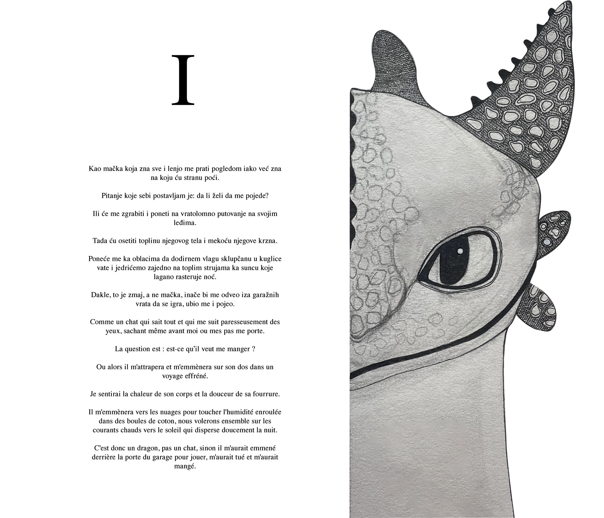
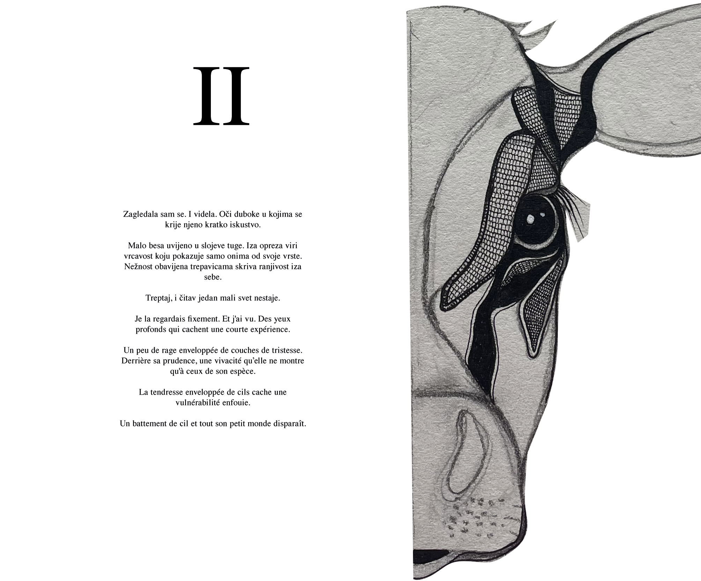
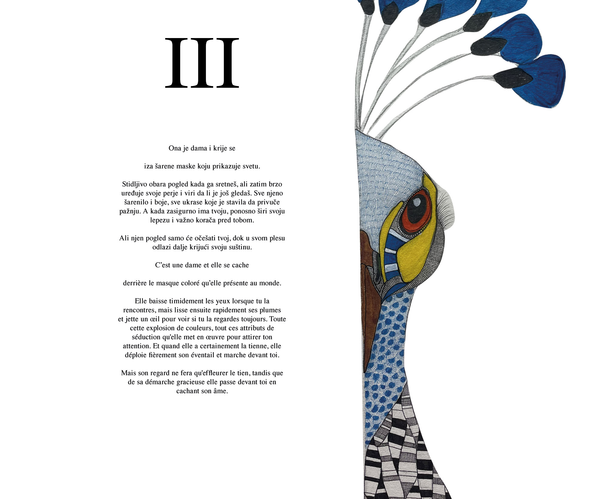
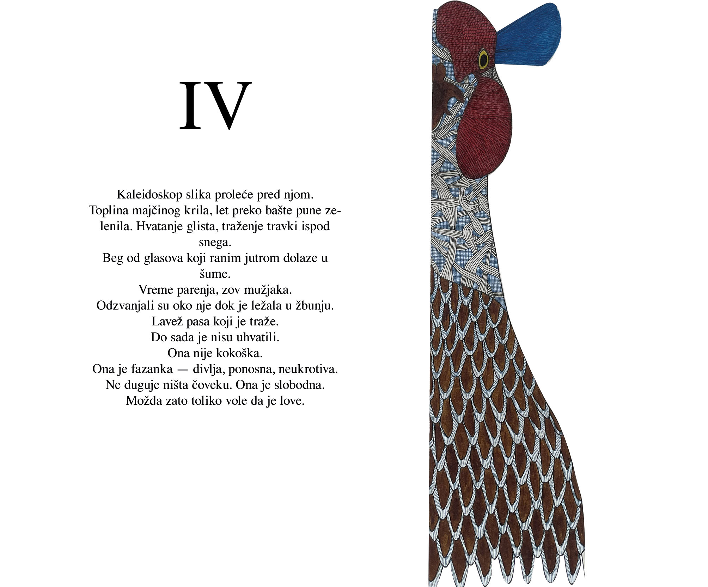

#  Art Collaboration Assets

### 𝙸𝚕𝚕𝚞𝚜𝚝𝚛𝚊𝚝𝚒𝚘𝚗 𝚂𝚎𝚛𝚒𝚎𝚜: 𝙰𝚛𝚝𝚒𝚜𝚝 𝙲𝚘𝚕𝚕𝚊𝚋𝚘𝚛𝚊𝚝𝚒𝚘𝚗

𝚃𝚑𝚒𝚜 𝚛𝚎𝚙𝚘𝚜𝚒𝚝𝚘𝚛𝚢 𝚜𝚑𝚘𝚠𝚌𝚊𝚜𝚎𝚜 𝚊 𝚜𝚎𝚛𝚒𝚎𝚜 𝚘𝚏 **𝚐𝚎𝚘𝚖𝚎𝚝𝚛𝚒𝚌 𝚍𝚒𝚐𝚒𝚝𝚊𝚕 𝚊𝚜𝚜𝚎𝚝𝚜** 𝚙𝚛𝚎𝚙𝚊𝚛𝚎𝚍 𝚊𝚜 𝚝𝚎𝚌𝚑𝚗𝚒𝚌𝚊𝚕 𝚋𝚊𝚜𝚎𝚕𝚒𝚗𝚎𝚜 𝚏𝚘𝚛 𝚙𝚛𝚘𝚏𝚎𝚜𝚜𝚒𝚘𝚗𝚊𝚕 𝚊𝚛𝚝𝚒𝚜𝚝𝚒𝚌 𝚍𝚎𝚟𝚎𝚕𝚘𝚙𝚖𝚎𝚗𝚝. 

𝙼𝚢 𝚛𝚘𝚕𝚎 𝚏𝚘𝚌𝚞𝚜𝚎𝚍 𝚘𝚗:
* **𝙿𝚛𝚎𝚌𝚒𝚜𝚎 𝙲𝚘𝚗𝚜𝚝𝚛𝚞𝚌𝚝𝚒𝚘𝚗:** 𝚅𝚎𝚌𝚝𝚘𝚛-𝚜𝚝𝚢𝚕𝚎 𝚏𝚘𝚛𝚖𝚜 𝚠𝚒𝚝𝚑 𝚌𝚕𝚎𝚊𝚗 𝚐𝚎𝚘𝚖𝚎𝚝𝚛𝚢.
* **𝙰𝚜𝚜𝚎𝚝 𝙾𝚙𝚝𝚒𝚖𝚒𝚣𝚊𝚝𝚒𝚘𝚗:** 𝙴𝚗𝚜𝚞𝚛𝚒𝚗𝚐 𝚟𝚒𝚜𝚞𝚊𝚕 𝚑𝚊𝚛𝚖𝚘𝚗𝚢 𝚊𝚗𝚍 𝚛𝚎𝚊𝚍𝚒𝚗𝚎𝚜𝚜 𝚏𝚘𝚛 𝚍𝚒𝚐𝚒𝚝𝚊𝚕 𝚙𝚛𝚘𝚍𝚞𝚌𝚝𝚒𝚘𝚗.
* **𝙲𝚘𝚕𝚕𝚊𝚋𝚘𝚛𝚊𝚝𝚒𝚟𝚎 𝙳𝚎𝚜𝚒𝚐𝚗:** 𝙼𝚎𝚎𝚝𝚒𝚗𝚐 𝚜𝚙𝚎𝚌𝚒𝚏𝚒𝚌 𝚠𝚘𝚛𝚔𝚏𝚕𝚘𝚠 𝚛𝚎𝚚𝚞𝚒𝚛𝚎𝚖𝚎𝚗𝚝𝚜 𝚏𝚘𝚛 𝚎𝚡𝚝𝚎𝚛𝚗𝚊𝚕 𝚌𝚛𝚎𝚊𝚝𝚒𝚟𝚎𝚜.

---

###  𝚅𝚒𝚜𝚞𝚊𝚕 𝙰𝚜𝚜𝚎𝚝𝚜

Vector Illustration no. 1  |   Vector Illustration no. 2

|  |   |

Vector Illustration no. 3  |   Vector Illustration no. 4

|  |    |

---

  𝚂𝚢𝚜𝚝𝚎𝚖𝚊𝚝𝚒𝚌 𝙳𝚎𝚜𝚒𝚐𝚗 ✦ 𝟸𝟶𝟸𝟺

